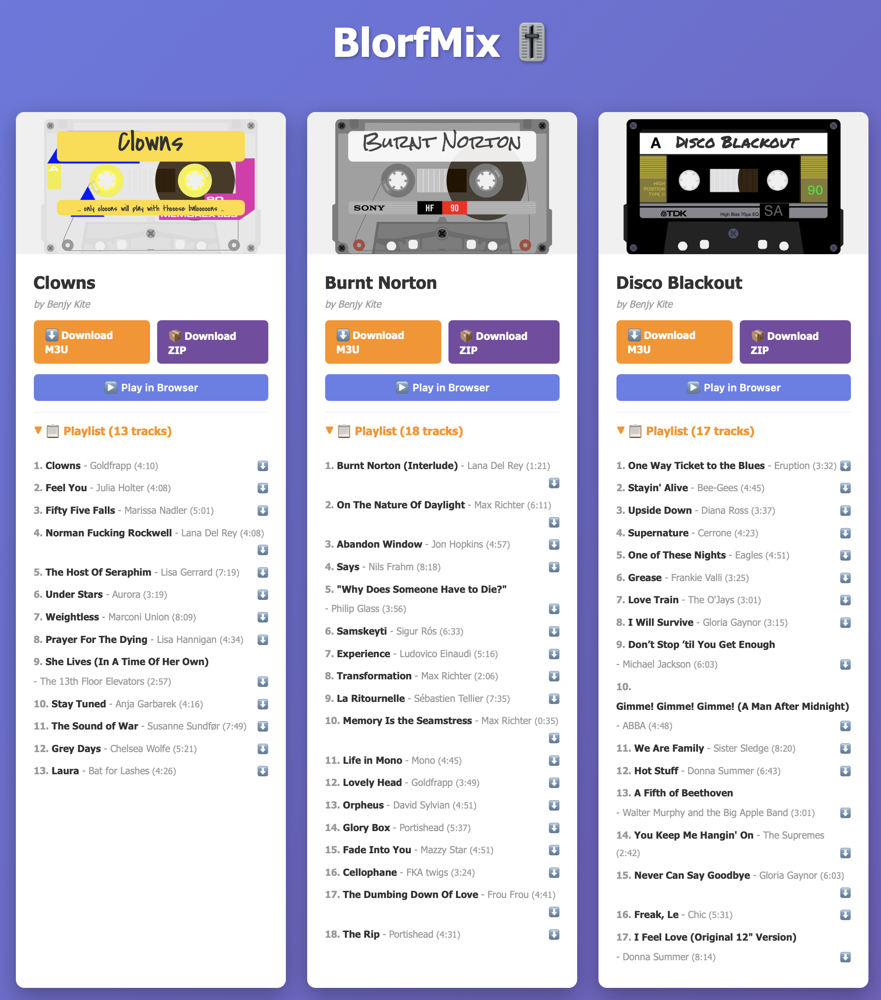
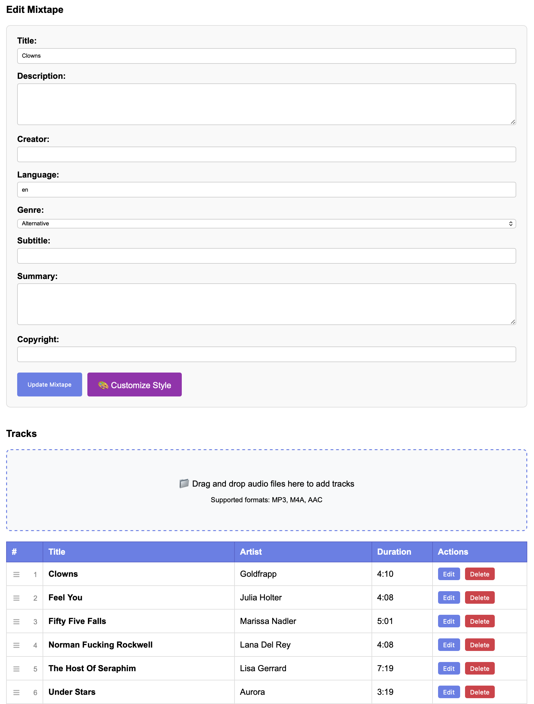
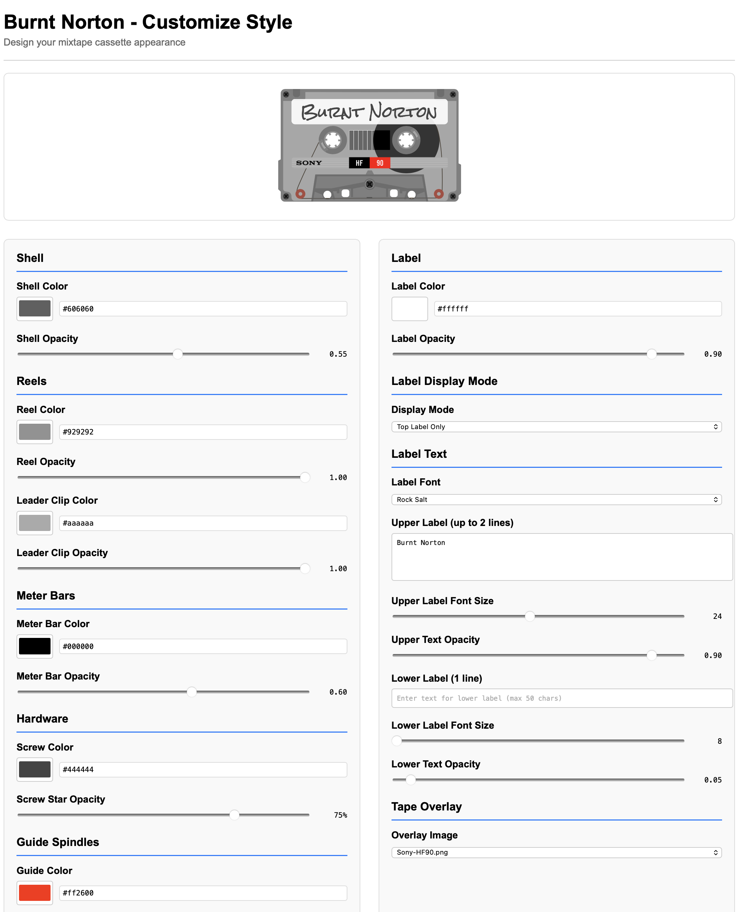

# BlorfMix

A lightweight, minimal mixtape management platform built with Flask. Create, manage, and share mixtapes with M3U playlist generation.

## Features

- **Google OAuth Integration** - Secure authentication via Google accounts
- **Mixtape Management** - Create and manage multiple mixtapes
- **Track Upload** - Drag-and-drop audio file upload with automatic metadata extraction
- **Metadata Extraction** - Automatically extract track metadata from MP3, M4A, and AAC files using mutagen:
  - Title, artist, genre, description, keywords
  - Duration and publication date
  - Embedded artwork
- **M3U Playlist Generation** - Generate M3U playlists with:
  - Proper track URLs and metadata
  - Duration and title information
  - Download support
- **Track Management** - Edit or delete tracks with automatic file cleanup
- **Public Directory** - Public listing of all mixtapes with M3U playlist links
- **Admin Dashboard** - Manage mixtapes and tracks

| Tape Index | Edit Tape | Custom Tape Case |
|:---:|:---:|:---:|
|  |  |  |

## Tech Stack

- **Framework**: Flask 3.0.0
- **Database**: SQLite with SQLAlchemy ORM
- **Authentication**: Google OAuth via authlib
- **Audio Processing**: mutagen (ID3v2, MP4)
- **Deployment**: Apache mod_wsgi

## Setup

### Requirements

- Python 3.12+
- Virtual environment

### Installation

```bash
# Create virtual environment
python3 -m venv geo
source geo/bin/activate

# Install dependencies
pip install -r requirements.txt

# Configure environment
cp .env.example .env
# Edit .env with your Google OAuth credentials and configuration
```

### Configuration

Set these environment variables in `.env`:

```
GOOGLE_CLIENT_ID=<your-google-client-id>
GOOGLE_CLIENT_SECRET=<your-google-client-secret>
GOOGLE_REDIRECT_URI=https://your-domain.com/authorize/google
SECRET_KEY=<your-secret-key>
APP_NAME=BlorfMix
DOCROOT=/path/to/podcast.dev.palodes.com
```

### Running

**Development:**
```bash
python run.py
```

**Production:**
```
# Via Apache mod_wsgi (see index.wsgi)
```

## Usage

1. **Create a Mixtape**: Navigate to `/admin`, click "Create New Mixtape" and fill in basic info
2. **Upload Tracks**: Add tracks to your mixtape with drag-and-drop upload
3. **Share M3U Playlist**: Each mixtape gets a unique M3U playlist at `/mixtape/<mixtape_id>/m3u`
4. **Download**: Share or download the M3U playlist URL

## Project Structure

```
app/
  __init__.py       # App factory, Flask setup
  config.py         # Configuration management
  models.py         # SQLAlchemy ORM models (Mixtape, Track)
  routes.py         # All API and view routes
  oauth.py          # Google OAuth setup
  static/
    tracks/         # Uploaded track audio files
    artwork/        # Mixtape artwork
  templates/
    index.html      # Public mixtape directory
    admin.html      # Mixtape management
    mixtape_admin.html  # Track management
    mixtape.m3u     # M3U playlist template
```

## API Endpoints

- `GET /` - Public mixtape directory
- `GET /admin` - Admin dashboard
- `GET /admin/mixtape/<id>` - Mixtape detail/track management
- `POST /api/create-mixtape` - Create new mixtape
- `POST /api/upload-track` - Upload track file
- `POST /api/delete-track` - Delete track
- `GET /mixtape/<id>/m3u` - M3U playlist for mixtape

## License

GNU General Public License v3.0 or later — see [COPYING](COPYING).

